# 🏦 Money Map – Pénzügyi Asszisztens

⚙️ **Megjegyzés:** A jelenlegi verzió még nem végleges! Folyamatos fejlesztés alatt áll, új funkciók és vizuális elemek bevezetése várható.

🔗 [Weboldal megtekintése](https://moneymaphun.netlify.app)

## 💸 Projekt leírása

A Money Map egy webes alkalmazás, amely lehetőséget nyújt kiadásaink és bevételeink nyomon követésére, céljaink meghatározására, valamint vizuális statisztikák megjelenítésére. A felhasználói élményre és egyszerű kezelhetőségre összpontosít, kezdők és haladók számára egyaránt.

📆 2025-ben indult projekt  
🧠 Kézi adatbevitel és célkezelés  
📊 Vizualizált statisztikák több nézetben

## 💼 Funkciók

| Funkció                             | Leírás                                                          |
| ----------------------------------- | --------------------------------------------------------------- |
| 📝 **Regisztráció / Bejelentkezés** | A főoldalon lehetőség van regisztrálni vagy bejelentkezni       |
| 📂 **Kategóriák kezelése**          | Egyéni kategóriák létrehozása a tranzakciókhoz                  |
| 💳 **Kiadások és bevételek**        | Manuális rögzítés: név, dátum, összeg, típus                    |
| 📋 **Kezelőpanel**                  | Adatok megtekintése, szerkesztése, törlése                      |
| 🎯 **Célok kezelése**               | Célok létrehozása, követése, módosítása, törlése                |
| 📈 **Statisztika**                  | Diagramok: bevételek és kiadások, célok előrehaladása           |
| ⚙️ **Beállítások**                  | Pénznem kiválasztása (jelenleg nem elérhető)                    |
| 👤 **Profil**                       | Profilkép módosítása, fiók törlése, felhasználónév megtekintése |

## 🖼️ Képernyőképek

### Főoldal

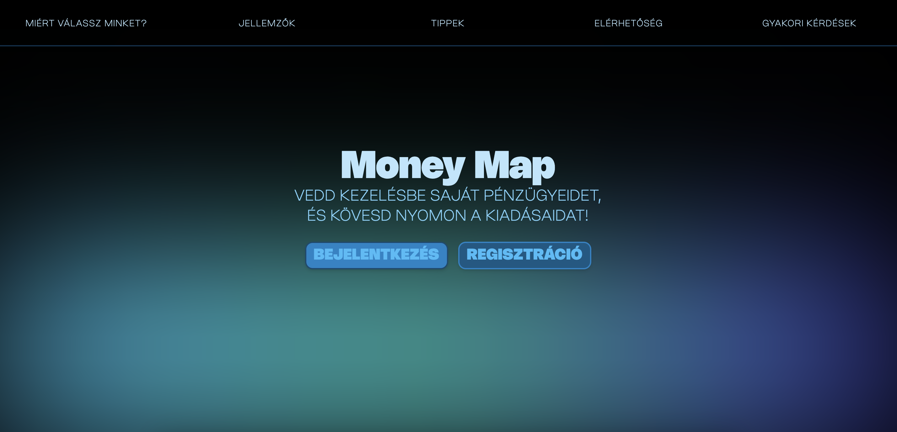

### Regisztráció

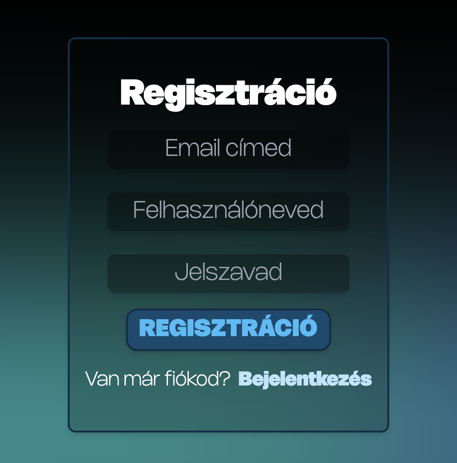

### Kezelőpanel – Tranzakciók

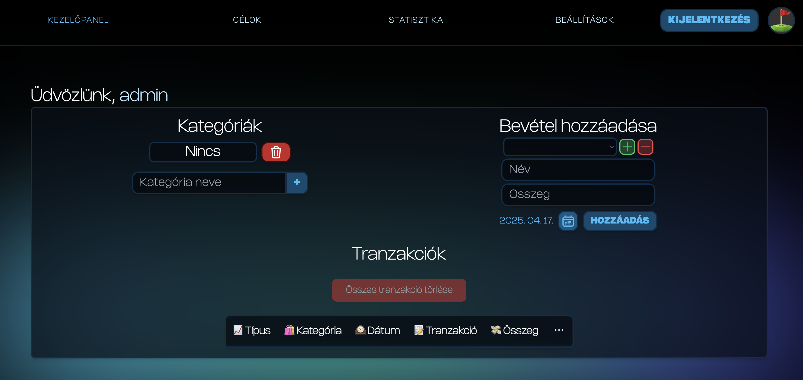  
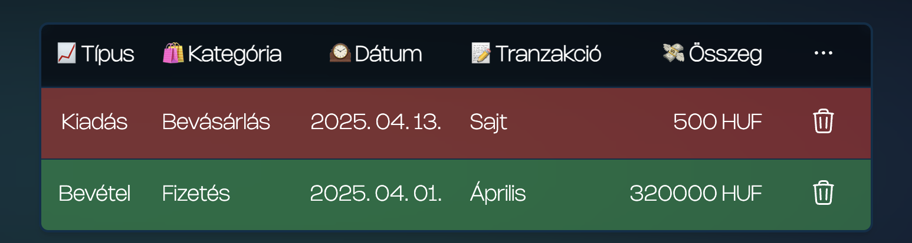

### Célok

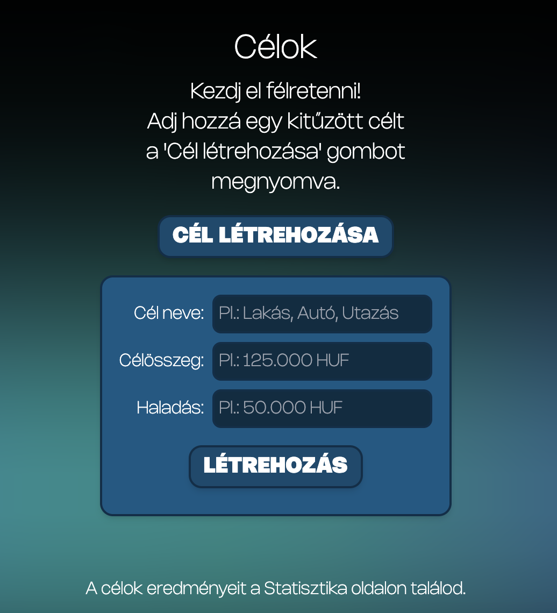

### Statisztika

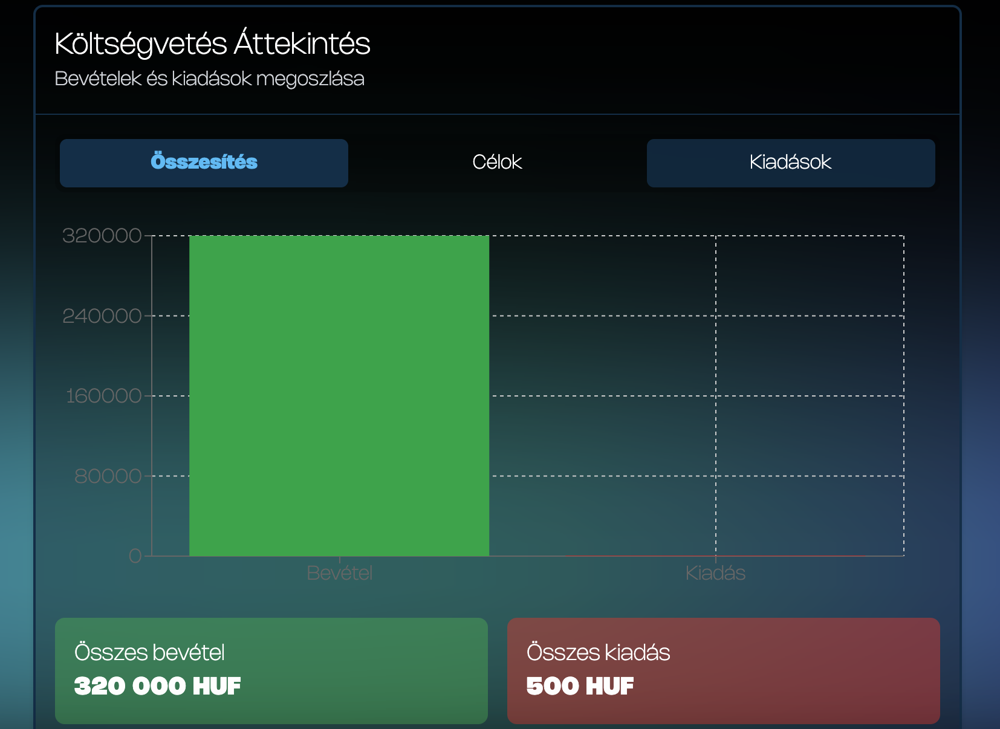

### Beállítások

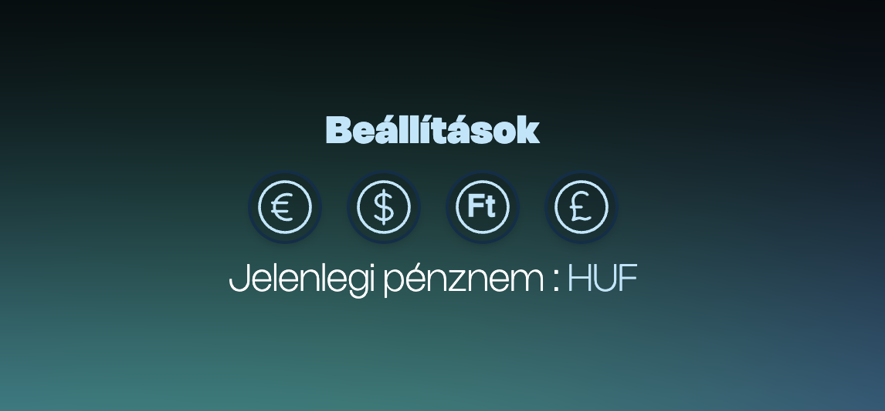

### Profil

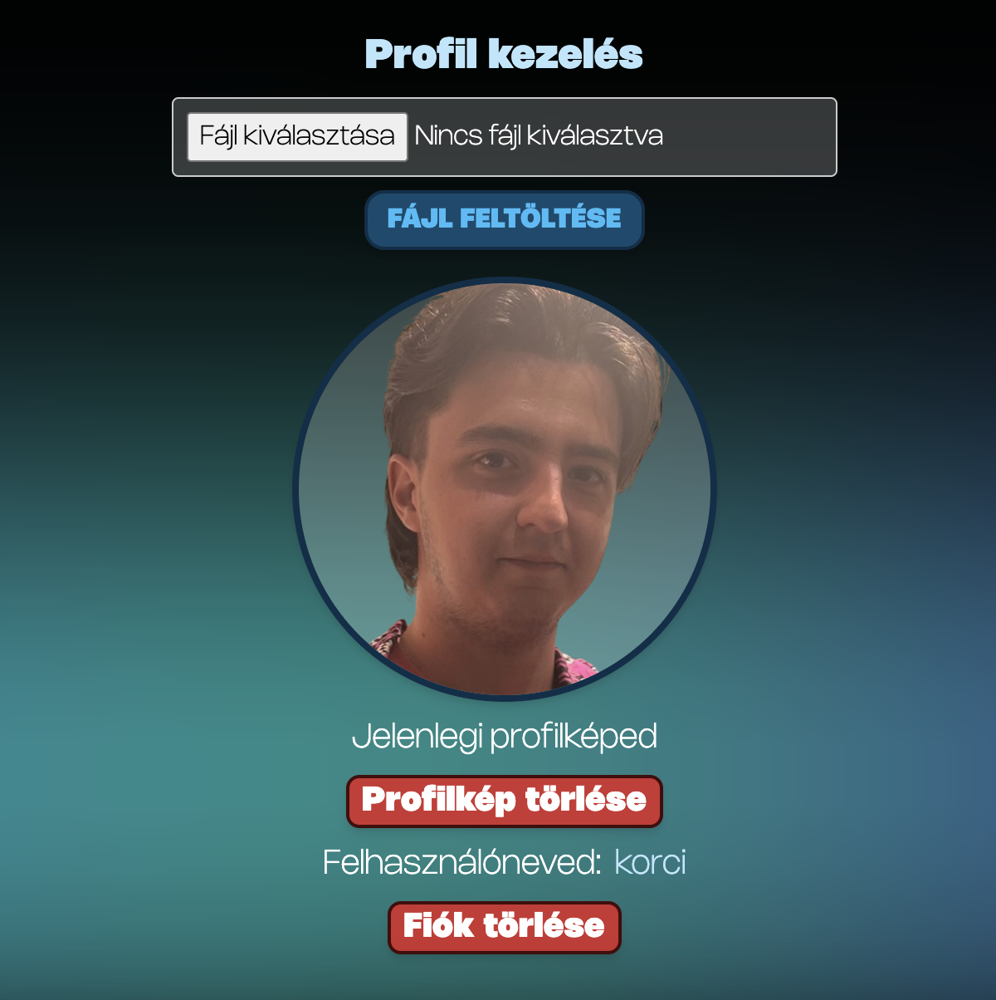

## 🌐 További menüpontok

### 📸 Miért válassz minket?

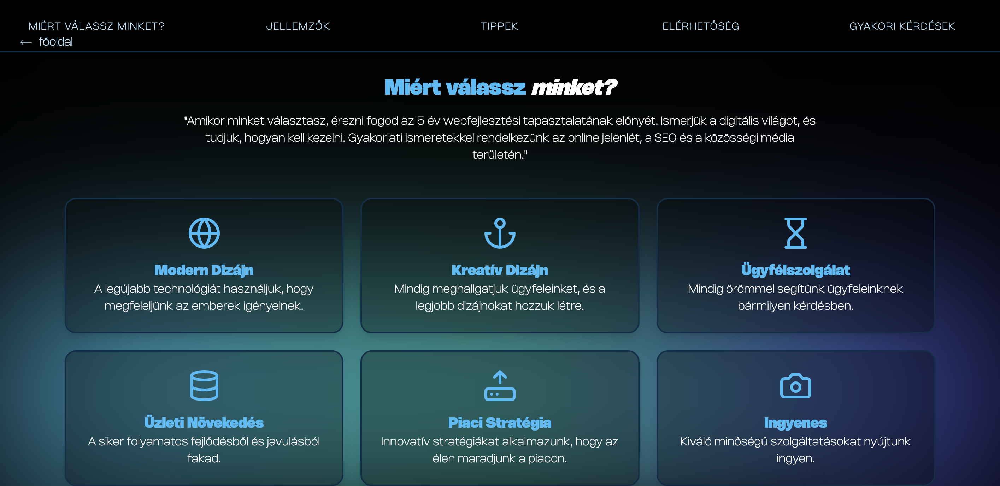

### 💡 Jellemzők

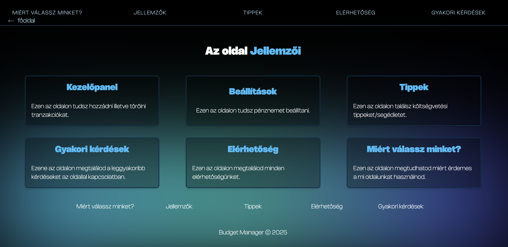

### 🧠 Tippek

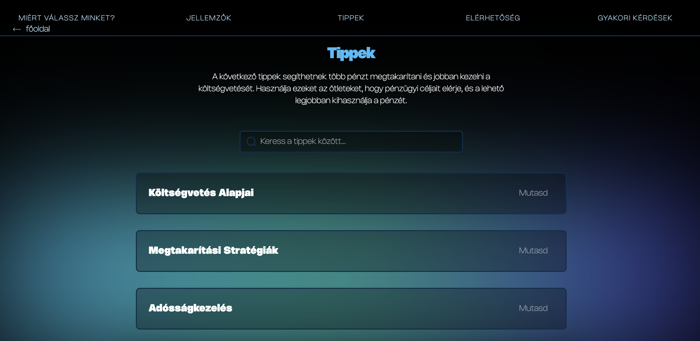

### 📬 Elérhetőség

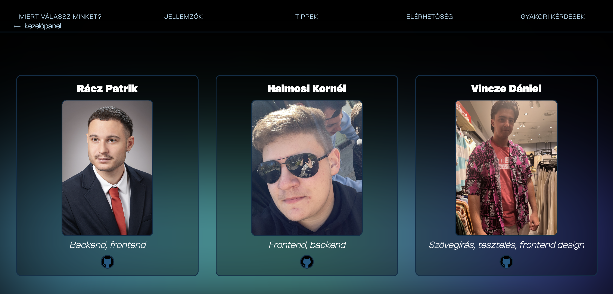

### ❓ Gyakori kérdések

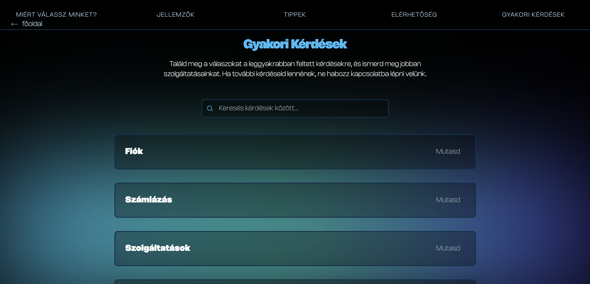

---

## 🛠️ Felhasznált technológiák

A Money Map fejlesztése során a következő modern technológiákat használtuk:

- **React** – a felhasználói felület kialakításához
- **Tailwind CSS** – a gyors és reszponzív designért
- **Cloudinary** – a képek kezeléséhez és tárolásához
- **Firebase** – az adatbázis és hitelesítés kezeléséhez
- **Express** – a szerveroldali logika megvalósításához
- **Axios** – az API-kommunikáció egyszerű és hatékony lebonyolításához

---

## 📌 A projekt célja

Egyszerűen kezelhető, átlátható felület biztosítása a pénzügyek tudatos nyomon követéséhez.

### 💡 Jövőbeli fejlesztések:

- Mesterséges intelligencia integrálása
- Banki applikációkból történő automatikus adatbeolvasás

---

## 👥 Készítők

| Név            | Szerepkör                                   |
| -------------- | ------------------------------------------- |
| Rácz Patrik    | Backend, Frontend összekötése, dokumentáció |
| Halmosi Kornél | Frontend, design, Firebase                  |
| Vincze Dániel  | Frontend, szövegírás, dokumentáció          |
