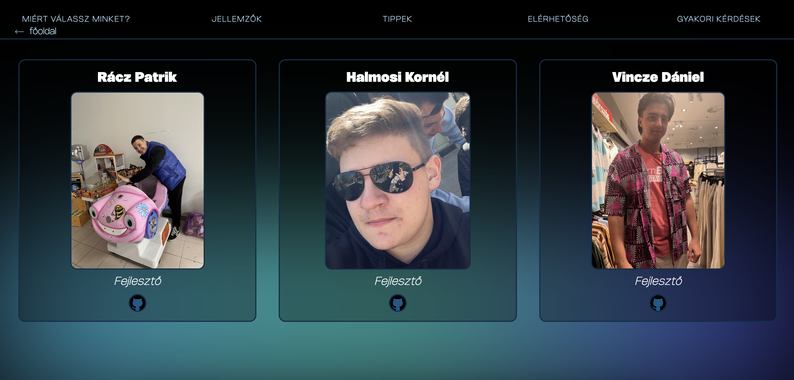

# 🏦 Money Map – Financial Assistant

A new level of financial awareness

⚙️ **Note:** This version is not final! Ongoing development is in progress, with new features and visual elements expected.

🔗 [View Website](https://moneymaphun.netlify.app)

## 💸 Project Description

Money Map is a web application that allows users to track their expenses and income, set financial goals, and view visual statistics. It focuses on user experience and ease of use, catering to both beginners and advanced users.

📆 Project started in 2025  
🧠 Manual data entry and goal management  
📊 Visualized statistics in multiple views

## 💼 Features

| Feature                     | Description                                           |
| --------------------------- | ----------------------------------------------------- |
| 📝 **Registration / Login** | Users can register or log in from the homepage        |
| 📂 **Category Management**  | Create custom categories for transactions             |
| 💳 **Expenses and Income**  | Manual entry: name, date, amount, type                |
| 📋 **Control Panel**        | View, edit, and delete data                           |
| 🎯 **Goal Management**      | Create, track, modify, and delete goals               |
| 📈 **Statistics**           | Charts: income and expenses, goal progress            |
| ⚙️ **Settings**             | Currency selection (currently not available)          |
| 👤 **Profile**              | Change profile picture, delete account, view username |

## 🖼️ Screenshots

### Homepage

### Registration

### Control Panel – Transactions

  

### Goals

### Statistics

### Settings

### Profile

## 🌐 Additional Menu Sections

### 📸 Why Choose Us?

### 💡 Features

### 🧠 Tips

### 📬 Contact

### ❓ Frequently Asked Questions

---

## 📌 Project Goal

To provide a simple, transparent interface for consciously tracking personal finances.

### 💡 Future Developments:

- Integration of artificial intelligence
- Automatic data import from banking applications

---

## 👥 Creators

| Name           | Role                                           |
| -------------- | ---------------------------------------------- |
| Patrik Rácz    | Backend, connecting frontend and backend, docs |
| Kornél Halmosi | Frontend, design, Firebase                     |
| Dániel Vincze  | Frontend, copywriting, documentation           |
